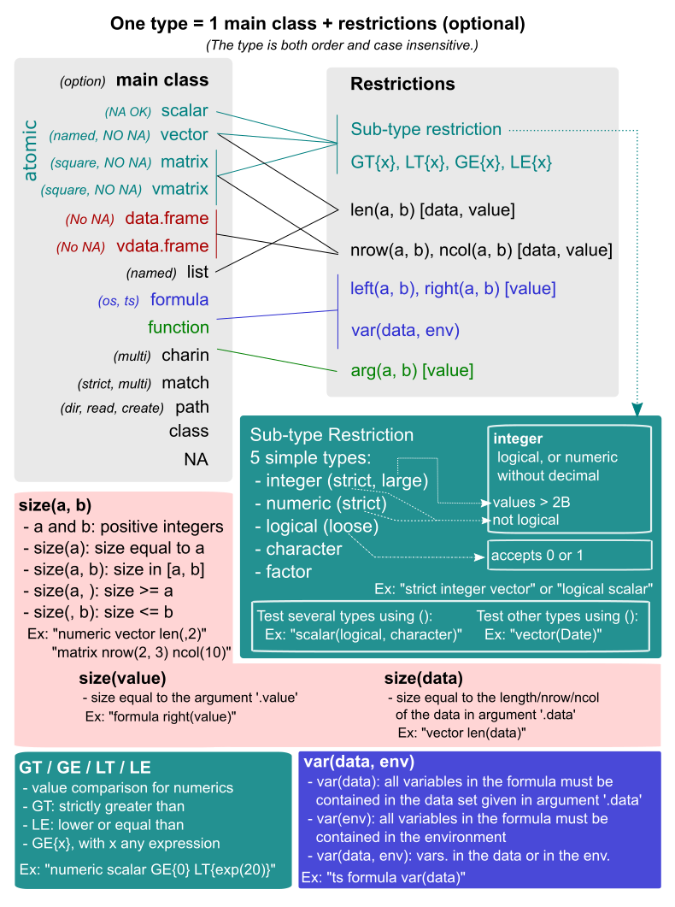

```{r setup, include=FALSE}
knitr::opts_chunk$set(echo = TRUE, eval = TRUE)
```

```{r, echo = FALSE}
library(dreamerr)
x = 1:5
y = pt

sum_check = function(...){
  check_arg(..., "numeric vector")
  sum(...)
}

Sys.setenv(LANG = "en")

```


This package aims to improve the user experience of R-users (just that! :-)). It offers developers, or anyone writing functions (therefore everyone!), a simple, flexible and powerful way to check all arguments passed to a function.

Debugging a call to a function can be a very frustrating experience: misleading and unclear error messages can make it quite long to finally make the function work. But this needs not be the case. The `dreamerr` package provides the `check_arg` function that does all the work of checking the arguments for you. From the developer side, it is easy and intuitive to perform a full check on the arguments passed to the function: in one line of code. From the user side, they will get, if they provide wrong arguments, useful and informative error messages. In terms of perfomance, since the code has been highly optimized, the cost of checking arguments with `check_arg` is close to 0.

This short introduction gives some basics on how to use `check_arg` after the following example.

# Motivating example

You have two numeric vectors x and y and you want to compute `sum(x, y)`:

```{r, error = TRUE}
sum(x, y)
```

Bam! there's a problem... If you're new to R, this message will look quite puzzling--and very unlikely to be helpful. Even if you're an experienced R user (who're acquainted to such error messages), it's impossible to understand from where the problem comes from.

Now you run the same function but with error-handling:

```{r, error = TRUE}
sum_check(x, y)
```

It's still an error. But now anyone can clearly understand the problem (even if you're a R-beginner)! It tells us that what we thought was a vector (`y`) was in fact a function. The time to debug this error is 0s due to the clarity of the error message: we know which argument is the culprit and we know exactly what the problem is.

There's a big gap in terms of user experience between the two functions, although there's only one line of code of difference between the two:
```{r, eval = FALSE}
sum_check = function(...){
  check_arg(..., "numeric vector")
  sum(...)
}
```

# How to use `check_arg`

The package offers (almost only) a single function: `check_arg`. This function must be placed within a function, its arguments must be argument names (the ones of the function), followed by the type these arguments are expected to have. As follows:


Here are detailed only the basics. For much more detailed information, with numerous examples, please see the help page of `check_arg`.

### Argument `.type`

The `.type` argument is the big thing. It supports literally hundreds of different types and uses natural language to express them. It must be a single character string, composed of several types each separated by a pipe (`|`). For example if we use `"logical scalar | ts formula | data.frame ncol(,2)"`, it means that the argument must be either: a logical scalar (i.e. `TRUE` or `FALSE`), ii) a two-sided formula, or iii) a data.frame with maximum 2 columns. Each pipe separates a type, each type is equal to one main class (here `scalar`, `formula` and `data.frame`) with (optionally) additional restrictions (here `logical`, `ts` and `ncol(,2)`). The table below shows the 13 different class codes and the restrictions they are associated to.



#### Classes

The meaning of the classes is as follows:

 - **scalar**: an atomic vector of length 1, no tolerance for NAs. Option `NA OK` allows NA values.
 
 - **vector**: an atomic vector (vector of list do not fall in this class), no tolerance for NAs. Option `NA OK` allows NA values, `named` requires the vector to have names.
 
 - **matrix**: a matrix, no tolerance for NAs. Option `NA OK` allows NA values, `square` requires the matrix to be square.
 
 - **vmatrix**: a matrix or vector, no tolerance for NAs. Option `NA OK` allows NA values, `square` requires the matrix to be square (if a vector, then it must be of length 1).
 
 - **data.frame**: an object that inherits from `data.frame`, tolerates NAs. Option `No NA` throws an error if it contains NAs.
 
 - **vdata.frame**: an object that inherits from `data.frame`, or a vector; tolerates NAs. Option `No NA` throws an error if it contains NAs.
 
 - **list**: a list. Option `named` requires it to have names.
 
 - **formula**: a formula. Option `os` (resp. `ts`) requires it to be one-sided (resp. two-sided).
 
 - **function**: a function.
 
 - **charin**: a character scalar that must be in a list of choices. Option `multi` accepts vectors of length greater than 1. You can provide the choices in the argument `.choices`, or directly in parentheses after the class: `charin(value1, value2, etc)`.
 
 - **match**: a character scalar that must be in a list of choices after partial matching. Option `multi` accepts vectors of length greater than 1, `strict` enables case sensitivity (which is off by default). This class also reassigns the argument after the partial matching. You have three ways to provide the choices: i) in the argument `.choices`, ii) directly in parentheses after the class: `match(value1, value2, etc)`, or iii) in the argument's default values, e.g. `fun = function(x = c("value1", "value2", etc))`.
 
 - **class**: an object whose class is listed in parentheses. Example: if `class(lm, glm)`, then only `lm` or `glm` arguments will be accepted.
 
 - **NA**: exactly `NA` (i.e. an atomic vector of length 1 equal to NA).
 
#### Restrictions


Each of these classes supports a set of restrictions, explained in Figure 2. 

All atomic classes support sub-type restriction and restrictions based on equality when the sub-type is numeric. The 5 simple sub-types support conversion with the keyword `conv`, if this keyword is present, then the value is converted to the appropriate type and re-assigned back to the argument.

You can ensure the arguments have the appropriate length, number of row or columns with `len(a, b)`, `nrow(a, b)` and `ncol(a, b)`. Instead of having hard values, you can enforce the arguments to have a length that depends on the context thanks to the `len(data)` or `len(value)` syntax. For instance, let's say you have an argument `weights`, you want it to be a vector whose length is equal to the number of observations in argument `base`, then you can use `check_arg(weights, "numeric vector len(data)", .data = base)`. You could alternatively use `check_arg(weights, "numeric vector len(value)", .value = NROW(base))`.

For formulas, there is a support for multi-part formulas (package [Formula](https://cran.r-project.org/package=Formula), Zeileis and Croissant 2010), you can restrict the number of parts on the left or right with the `left(a, b)` and `right(a, b)` syntax. You can also ensure that all variables contained in the formula are either in the data set provided in the argument `.data` or in the environment with the `var(data, env)` syntax.

For functions, you can restrict the number of arguments they have with `arg(a, b)`.

#### Globals

On top of the types, you also have 8 global keywords that can be anywhere in the type character string. These globals are:

 - **MBT**: requires the user to provide the argument (Must Be There).

 - **NULL**: allows the argument to be `NULL`.
 
 - **NULL{expr}**: allows the argument to be `NULL`, if `NULL`, then the argument is re-assigned the value of `expr`.
 
 - **safe NULL**: allows the argument to be `NULL` but forbids the argument to be of the type `x$a` since `NULL` values in this case are often mistakes--especially useful when the argument is a vector.
 
 - **L0**: allows the argument to be of 0-length (by default, there's always an error for 0-length arguments). 
 
 - **eval**: evaluates the argument in a data set given in the argument `.data`.
 
 - **evalset**: evaluates the argument in a data set given in the argument `.data`, then re-assigns the obtained value to the argument.
 
 - **dotnames**: when checking the `...` argument, requires all elements to be named.

#### `check_arg_plus`

Actually there are two functions to check arguments: `check_arg` and `check_arg_plus`. The difference between the two is that i) the second allows keywords that re-assigns values to the argument (i.e. the `match` class, the `conv` keyword, `NULL{expr}`, and `evalset`), and ii) allows to check list elements of list arguments.

Let's illustrate when to use `check_arg_plus`:

```{r}
plot_cor = function(x, y = NULL, line.opts = list(), ...){
  # x: numeric vector, must be given by the user
  check_arg(x, "numeric vector mbt")
  # y: 
  #  - numeric vector of the same length as x
  # - if y is NULL, then x with some noise is assigned to it 
  check_arg_plus(y, "NULL{x + rnorm(length(x))} numeric vector len(data)", .data = x)
  
  # We ensure line.opts is a list (even of 0-length)
  check_arg(line.opts, "named list L0")
  
  # The linear regression + options from ...
  reg = lm(y ~ x, ...)
  
  # plotting the correlation
  plot(x, y)
  
  # The fit, all arguments are in line.opts
  # col:
  # - if not provided => "firebrick"
  # - partially matched to firebrick or darkblue
  # - otherwise, a positive integer or a character scalar
  check_arg_plus(line.opts$col, "NULL{'firebrick'} match(firebrick, darkblue) | scalar(integer, character) GE{0}") 
  # lwd:
  # - if not provided => 2
  # - otherwise a positive integer scalar
  check_arg_plus(line.opts$lwd, "integer scalar GE{0} NULL{2}") # check + default
  
  line.opts$a = reg
  do.call("abline", line.opts)
}

plot_cor(rnorm(100), line.opts = list(col = "dark"))

```

Why sperating argument checking in two functions? First, it is because `check_arg_plus` requires (marginally, but still) more processing--so it's better to always use the faster function when appropriate, and use `check_arg_plus` only when needed. Second, and this is the main reason, it is because `dreamerr` allows the user to turn off argument checking with `setDreamerr_check(FALSE)`. If a call to a function works, then writting off all `check_arg` calls would also work. This is not the case for `check_arg_plus` since it re-assigns values to the arguments--and therefore can't be turned off.

#### Developer mode

Ironically, to improve perfomance (since its computational footprint should be very low), there is almost no error-handling in `check_arg`!

But no worries: if you turn the developer mode on with `setDreamerr_dev.mode(TRUE)`, an in-depth check of any call to dreamerr's functions will be performed. This is especially useful if you are not familiar with the syntax. 

Yet beware, this error checking is really in-depth, thus rather computationnally intensive (about half a millisecond). Thus the developer mode should be off the majority of the time.

 
# Adding error-handling to `lm`

Now that we know how to use `check_arg`, let's provide some error-handling to the `lm` function. There is still need to check some stuff after that, but the bulk of the job is done (the code is long because of the comments, otherwise it's 9 lines for 13 arguments):

```{r}
lm_check = function(formula, data, subset, weights, na.action, method = "qr", model = TRUE, x = FALSE, y = FALSE, qr = TRUE, singular.ok = TRUE, contrasts = NULL, offset, ...){

  # data:
  # - data.frame or named list (a data.frame is a named list, but it is still added for clarity)
  check_arg(data, "data.frame | named list")
  
  # formula:
  # - must be provided by the user (mbt)
  # - must be two-sided (ts)
  # - variables must be in the data or in the environment [var(data, env)]
  check_arg(formula, "ts formula var(data, env) mbt", .data = data)
  
  # subset:
  # - either a logical or an integer vector
  # - can be a variable of the data set (eval)
  check_arg(subset, "eval vector(strict logical, strict integer)", .data = data)
  
  # weights:
  # - vector of positive integers
  # - can be NULL
  # - can be a variable of the data set (eval)
  check_arg(weights, "eval vector numeric GE{0} safe null", .data = data)

  # na.action:
  # - can be NULL
  # - must be a function with at least one argument
  check_arg(na.action, "null function arg(1,)")

  # method:
  # - either 'qr' or 'model.frame', partially matched
  check_arg_plus(method, "match(qr, model.frame)")

  # You can pool arguments of the same type:
  check_arg(model, x, y, qr, singular.ok, "logical scalar")

  # contrasts:
  # - NULL or list
  check_arg(contrasts, "null list")

  # offset:
  # - can be NULL
  # - numeric matrix or vector
  check_arg(offset, "null numeric vmatrix")

  mc = match.call()
  mc[[1]] = as.name("lm")

  eval(mc, parent.frame())
}
```

And that's it, now you get very precise error messages if you pass wrong arguments in `lm_check`. Note that in terms of function design, you could require that: i) the user must provide a data.frame, and ii) all variables in the formula must be in the data.frame. Doing that, you can save some further error handling down the road: 

```{r}
lm_check_bis = function(formula, data, subset, weights, na.action, method = "qr", model = TRUE, x = FALSE, y = FALSE, qr = TRUE, singular.ok = TRUE, contrasts = NULL, offset, ...){

  # data: now only a data.frame and required
  check_arg(data, "data.frame mbt")
  
  # formula: All variables must be in the data
  check_arg(formula, "ts formula var(data) mbt", .data = data)
  
  # subset: => now we can be more precise
  # - if logical: must be of the same length as the data (otherwise it's a mistake)
  # - if integer, can be of any length (strict integer is used, because we don't want it to be logical)
  check_arg(subset, "eval vector strict logical len(data) | vector strict integer", .data = data)
  
  # weights:vector of positive integers, of the same length as the data
  check_arg(weights, "eval vector numeric GE{0} safe null len(data)", .data = data)

  # Below: same as before
  check_arg(na.action, "null function arg(1,)")
  check_arg_plus(method, "match(qr, model.frame)")
  check_arg(model, x, y, qr, singular.ok, "logical scalar")
  check_arg(contrasts, "null list")
  
  # we extract the left hand side (it can be multi response)
  y = eval(formula[[2]], data)

  # offset:
  # - if y is a matrix => offset must be a matrix of the same number of columns
  check_arg(offset, "null numeric vmatrix ncol(data)", .data = y)

  mc = match.call()
  mc[[1]] = as.name("lm")

  eval(mc, parent.frame())
}
```

Using argument checking when writing functions also shows you precisely what you expect the user to provide. It can help to design the code.

# References

Zeileis A, Croissant Y (2010). "Extended Model Formulas in R: Multiple Parts and Multiple Responses." *Journal of Statistical Software*, 34(1), 1–13. URL [](http://www.jstatsoft.org/v34/i01/).


